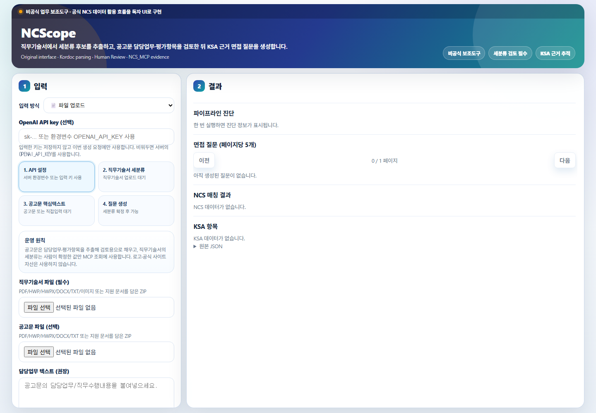
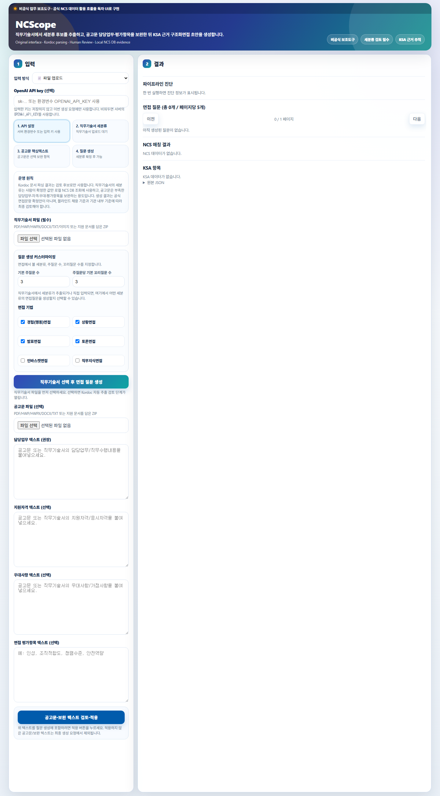

# NCScope

[](https://github.com/koul777/NCScope/actions/workflows/ci.yml)

공공기관 채용 공고문과 직무기술서를 올리면, NCS 세분류를 확인한 뒤 공식 KSA 근거로 구조화 면접 질문 초안을 생성하는 프로그램입니다.

NCScope는 직무기술서 파일을 Kordoc으로 파싱하고, 사람이 세분류를 최종 확인한 다음, 로컬 NCS DB 검색 서버인 NCS_MCP를 통해 공식 능력단위·수행준거·KSA를 조회합니다. 이후 해당 근거를 바탕으로 주질문, 꼬리질문, 평가포인트가 포함된 구조화 면접 질문 초안을 생성합니다.



공고문 또는 보완 텍스트는 별도 적용 버튼을 눌러야 최종 질문 생성 요청에 포함됩니다.



NCScope는 공식 NCS 사이트가 아닙니다. NCS 데이터 활용 흐름과 공공서비스형 정보 구조만 참고했으며, 공식 로고·아이콘·이미지·사이트 레이아웃을 복제하지 않는 독자 UI입니다.

운영 전제: NCScope 결과물은 공식 면접문항 확정안이 아니라 보조자료 초안입니다. 최종 문항은 기관 담당자와 평가위원이 블라인드 채용 기준, 채용공고, 직무기술서, 내부 평가기준에 맞게 검토·수정해야 합니다.

공식 서비스와의 관계, 데이터 사용, 면접 운영 책임에 대한 고지는 [`NOTICE.md`](NOTICE.md)를 참고하세요. API key와 업로드 문서 처리 기준은 [`SECURITY.md`](SECURITY.md)에 정리했습니다. Kordoc 등 외부 구성요소 고지는 [`THIRD_PARTY_NOTICES.md`](THIRD_PARTY_NOTICES.md)에 분리했습니다.

화면은 네 단계로 구성됩니다.

1. API 설정
2. 직무기술서 세분류 검토
3. 공고문 핵심텍스트 보완
4. 로컬 NCS DB KSA 기반 질문 생성

## 왜 필요한가

공공기관 채용 실무에서는 직무기술서, 공고문, NCS 세분류, 능력단위, 수행준거, KSA를 사람이 일일이 맞춰 보며 면접 질문을 설계해야 합니다. 이 과정은 시간이 오래 걸리고, 세분류를 잘못 잡으면 질문의 근거가 흔들립니다.

NCScope의 목표는 다음 흐름을 하나로 묶는 것입니다.

```text
직무기술서 업로드
        ↓
Kordoc 문서 파싱 및 세분류 후보 추출
        ↓
사람이 NCS 세분류 확인
        ↓
공고문으로 담당업무·자격·우대사항·평가항목 보완
        ↓
로컬 NCS DB 검색 서버에서 공식 능력단위·KSA 조회
        ↓
구조화 면접 질문 초안 생성
```

## 핵심 기능

- PDF/HWP/HWPX/DOCX/TXT/이미지 직무기술서와 해당 파일을 담은 ZIP 파싱
- 소분류가 아니라 세분류 기준 NCS 후보 추출
- Human-in-the-loop 방식의 세분류 검토·확정
- 확정된 세분류 기준 로컬 NCS DB 검색 서버(NCS_MCP)에서 공식 능력단위 조회
- 공식 수행준거·KSA 기반 면접 질문 초안 생성
- 세분류별 주질문 수, 주질문당 꼬리질문 수, 면접기법 선택
- 경험(행동)면접, 상황면접, 발표면접, 토론면접, 인바스켓면접, 직무지식면접 유형별 질문 생성
- 주질문, 꼬리질문, 평가포인트, NCS 매칭 결과, 질문별 KSA 근거 제공
- 면접기법별 주질문 형식, 꼬리질문 깊이, 평가포인트, KSA 근거, 직무 맥락 품질 게이트 적용
- ALIO 실문서 기반 질문 품질 리포트와 모델 원문/템플릿 보정 분리 측정
- NCS 블라인드 채용 면접과제·평가양식 샘플 프로파일링으로 면접기법별 형식 검증
- OpenAI API key를 화면에서 요청 단위로 입력 가능
- 로컬 NCS DB 검색 서버 연결 기반의 경량 배포 구조
- 공식 NCS 사이트 자산을 사용하지 않는 비공식 독자 인터페이스

## 사용 방법

### 가장 쉬운 로컬 실행

Windows에서 이 저장소를 받은 뒤 `START_NCSCOPE.bat`를 더블클릭하면 됩니다.

실행 파일은 다음 순서로 동작합니다.

1. `.env`가 있으면 환경변수를 불러옵니다.
2. `NCS_MCP_URL`이 로컬 주소이고 아직 켜져 있지 않으면 `C:\workspace\NCS_MCP` 또는 `..\NCS_MCP`의 로컬 NCS DB 검색 서버를 자동으로 시작합니다.
3. NCScope 앱을 `http://127.0.0.1:8015`에서 실행합니다.
4. 브라우저를 자동으로 엽니다.

현재 PC처럼 `C:\workspace\NCS_MCP\data\processed\ncs.db`가 준비되어 있으면 별도 명령 없이 실행됩니다. 다른 위치를 쓰는 경우 `.env`에 다음 값을 지정하세요.

```text
NCS_MCP_REPO=C:\workspace\NCS_MCP
NCS_DB_PATH=C:\workspace\NCS_MCP\data\processed\ncs.db
NCS_MCP_URL=http://127.0.0.1:8778/mcp
```

### 1. 화면 열기

로컬 또는 배포된 NCScope 주소를 엽니다.

```text
http://127.0.0.1:8015
```

### 2. OpenAI API key 입력

화면의 `OpenAI API key` 칸에 키를 입력할 수 있습니다.

- 입력한 키는 브라우저 저장소나 서버 DB에 저장하지 않습니다.
- 해당 생성 요청에만 FormData/JSON으로 전달됩니다.
- 비워 두면 서버의 `OPENAI_API_KEY` 환경변수를 사용합니다.
- 응답 JSON에는 키 원문이 포함되지 않고 `request`, `env`, `missing` 상태만 표시됩니다.

### 3. 직무기술서 업로드

`직무기술서 파일`에 PDF/HWP/HWPX/DOCX/TXT/PNG/JPG/WEBP 파일 또는 해당 파일을 담은 ZIP을 올립니다.

Kordoc 파싱이 끝나면 다음 항목이 검토 영역에 표시됩니다.

- 수행업무
- 지원자격
- 우대사항
- 확정할 NCS 세분류

### 4. 세분류 검토·확정

자동 추출된 세분류가 맞는지 사람이 확인합니다.

예시:

```text
경영기획
총무
정보기술기획
프로젝트관리
```

필요하면 직접 수정한 뒤 `추출 결과 검토·확정` 버튼을 누릅니다.

이 단계가 중요한 이유는 NCScope가 소분류나 키워드가 아니라, 사람이 확정한 세분류를 기준으로 로컬 NCS DB 검색 서버(NCS_MCP)를 조회하기 때문입니다.

확정한 세분류가 현재 로컬 NCS serving DB와 정확히 매칭되지 않으면 NCScope는 근거 없는 질문을 자동 생성하지 않습니다. 대신 후보 NCS 능력단위를 보여주고, 담당자가 직접 선택하는 흐름으로 전환합니다.

### 5. 질문 생성 조건 설정

세분류 확정 후 다음 조건을 지정합니다.

- 어떤 세분류의 질문을 생성할지
- 세분류별 주질문 수
- 주질문당 꼬리질문 수
- 면접기법

지원하는 면접기법:

- 경험(행동)면접: 과거 수행 행동을 중심으로 미래 성과를 예측합니다.
- 상황면접: 주어진 직무 상황에서 판단, 판단 이유, 행동 의도를 묻습니다.
- 발표면접: 특정 주제나 자료에 대해 분석, 대안, 실행계획을 발표하게 합니다.
- 토론면접: 갈등 요소가 있는 과제를 두고 상호작용, 경청, 조정, 합의 도출을 봅니다.
- 인바스켓면접: 실제 직무 조건을 반영한 문서·요청·우선순위 처리 과제를 제시합니다.
- 직무지식면접: 절차, 기준, 산출물, 예외상황 대응 지식을 확인합니다.

면접기법별 질문 방식은 `['24년 능력중심 채용모델] 평가위원 가이드북`의 구조화 면접 원칙과 NCS 블라인드 채용 면접과제·평가양식 샘플에서 관찰되는 과제·평가 양식 구조를 반영했습니다.

### 6. 공고문 업로드와 핵심 텍스트 보완

공고문은 선택 항목입니다. 직무기술서에 부족한 정보를 보완할 때 사용합니다.

- 공고문 파일
- 담당업무 텍스트
- 지원자격 텍스트
- 우대사항 텍스트
- 면접 평가항목 텍스트

공고문 파일을 올리면 NCScope가 담당업무, 지원자격, 우대사항, 면접 평가항목 후보를 먼저 채웁니다. 담당자는 이 내용을 검토하고 수정한 뒤 `공고문 핵심 텍스트 검토·적용`을 누르면 됩니다.

직무기술서에만 지원자격이나 우대사항이 들어 있는 경우도 처리합니다. 직무기술서 파싱 결과와 공고문 파싱 결과 중 어느 한쪽에라도 해당 내용이 있으면 중복을 제거해 질문 생성 컨텍스트에 함께 반영합니다.

주의: 공고문 파일이나 보완 텍스트를 입력해도 `공고문·보완 텍스트 검토·적용` 버튼을 누르기 전에는 최종 질문 생성 요청에 포함되지 않습니다. 텍스트를 수정하면 적용 상태가 다시 해제되므로, 수정 후 다시 적용해야 합니다.

예시:

```text
담당업무: 경영계획 수립, 사업성과 분석, 예산 운영 지원
지원자격: 관련 분야 실무경력 3년 이상
우대사항: 공공기관 사업관리 경험
평가항목: 문제해결능력, 의사소통능력, 청렴성, 조직적합도
```

### 7. 면접 질문 생성

`NCS DB KSA 기반 면접 질문 생성`을 누릅니다.

결과 영역에서 다음을 확인할 수 있습니다.

- 파이프라인 진단
- NCS 매칭 결과
- KSA 항목
- 구조화 면접 질문
- 질문별 KSA 근거
- 원본 JSON

세분류 exact 매칭이 실패한 경우에는 직접입력 모드로 전환됩니다. 이때 표시되는 후보 NCS 능력단위는 자동 확정값이 아니며, 담당자가 공식 NCS 명칭과 직무기술서를 비교해 선택해야 합니다.

## 면접 질문 품질 관리

NCScope는 질문 생성 결과를 그대로 통과시키지 않고 면접기법별 품질 게이트로 다시 점검합니다.

- 주질문이 선택한 면접기법의 형식을 따르는지 확인합니다.
- 꼬리질문이 단순 추가 질문이 아니라 판단 근거, 행동, 우선순위, 반대 의견, 자료 해석 등 기법별 후속 탐침 역할을 하는지 확인합니다.
- 평가포인트가 다른 면접기법의 루브릭으로 오염되지 않았는지 확인합니다.
- 질문, 꼬리질문, 평가포인트, 질문 초점 중 하나 이상에 선택된 NCS/KSA 근거가 실제로 반영되는지 확인합니다.
- 직무기술서 세분류에 따라 조리, 보건, 복지, 물류, 보안, 시설, 에너지, 수질, 정보기술 등 현장 자료와 이해관계자 표현을 다르게 구성합니다.
- 모델이 만든 원문 질문이 기준을 통과하지 못하면 템플릿 기반 보정 질문으로 교체하고, 교체 사유를 리포트에 남깁니다.

현재 로컬 검증 환경에서는 `OPENAI_API_KEY`가 없어 모델 원문 질문 품질은 측정하지 않았습니다. 대신 템플릿 보정 경로가 ALIO 실문서에서 면접기법·KSA·직무맥락 기준을 만족하는지 분리해 측정합니다.

## 결과물 예시

생성 결과는 다음 구조를 가집니다.

```json
{
  "interview_questions": [
    {
      "type": "경험면접",
      "competency": "경영계획 수립",
      "ncsClCd": "0201010103_22v2",
      "question_source": "model_generated 또는 template_fallback",
      "question": "사업 목표를 수립하거나 조정한 경험 중 가장 어려웠던 사례를 말씀해 주세요.",
      "follow_ups": [
        "당시 목표 설정의 근거는 무엇이었습니까?",
        "이해관계자 의견이 충돌했을 때 어떻게 조정했습니까?",
        "결과를 어떤 지표로 평가했습니까?"
      ],
      "evaluation_points": [
        "환경분석 능력",
        "목표수립의 타당성",
        "이해관계자 조정",
        "성과관리 관점"
      ]
    }
  ]
}
```

## 시스템 구조

NCScope는 앱과 로컬 NCS DB 검색 서버(NCS_MCP)를 분리해서 배포합니다.

| 구성요소 | 역할 |
| --- | --- |
| NCScope FastAPI 앱 | 화면, 업로드, 검토, 질문 생성 흐름 제어 |
| Kordoc | PDF/HWP/HWPX/DOCX/TXT/이미지 및 ZIP 내부 지원 문서 파싱 |
| NCS_MCP | 로컬 NCS DB 검색 서버. 공식 NCS 능력단위·수행준거·KSA 조회 담당 |
| serving DB | 약 117MB 경량 read-only SQLite DB |
| OpenAI API | 구조화 면접 질문 생성 및 선택적 재정렬 |

```text
사용자
  ↓
NCScope UI
  ↓
FastAPI
  ├─ Kordoc 문서 파싱
  ├─ Human review gate
  ├─ NCS_MCP_URL → 로컬 NCS DB 검색 서버에서 공식 NCS/KSA 조회
  └─ OpenAI API → 질문 생성
```

## 설치 방법

### 1. 저장소 받기

```powershell
git clone https://github.com/koul777/NCScope.git
cd NCScope
```

### 2. Python 패키지 설치

```powershell
pip install -r requirements.txt
```

### 3. Kordoc 설치

```powershell
npm ci
```

`npm ci`는 `scripts/kordoc_parse.mjs`에서 사용하는 Kordoc Node 패키지를 설치합니다.

NCScope에서 Kordoc은 문서 본문, 표, 메타데이터를 파싱해 검토 후보를 만드는 역할만 합니다. Kordoc 결과가 곧바로 NCS 세분류나 면접 질문으로 확정되지는 않으며, 세분류 검토·확정 단계에서 사람이 확인해야 합니다.

## 로컬 NCS DB 검색 서버(NCS_MCP) 준비

NCScope 앱은 NCS SQLite DB를 직접 열지 않습니다. 경량 serving DB를 읽는 로컬 NCS DB 검색 서버(NCS_MCP)를 별도 프로세스로 실행해야 합니다.

```powershell
$env:NCS_DB_PATH="C:\data\ncs_interview_serving_release.db"
$env:NCS_MCP_READ_ONLY="1"
python -m ncs_mcp.server --transport streamable-http --host 127.0.0.1 --port 8778
```

NCS_MCP 필수 도구:

- `ncs_search`
- `ncs_unit_detail`

준비된 serving DB 아티팩트:

- Release URL: `https://github.com/koul777/NCScope/releases/tag/ncscope-db-v0.1.0-20260723`
- Release tag: `ncscope-db-v0.1.0-20260723`
- DB asset: `ncs_interview_serving_release.db`
- Manifest asset: `ncs_interview_serving_release.json`
- DB SHA-256: `F9BB59B8853E8F69DC4698028EC347ED9BD74D26133FBCEB031B05FD90F89B23`

## NCScope 실행

로컬에서는 `.env.example`을 `.env`로 복사한 뒤 필요한 값을 채울 수 있습니다.

```powershell
Copy-Item .env.example .env
```

보안상 FastAPI 앱 import 시점에는 `.env`를 자동으로 읽지 않습니다. 로컬 실행은 `.\run_local.ps1`을 권장합니다. 이 스크립트는 현재 프로세스에만 `.env` 값을 읽어 들이며, 키 원문은 출력하지 않습니다.

```powershell
$env:NCS_MCP_URL="http://127.0.0.1:8778/mcp"
$env:MAX_UPLOAD_MB="30"
python -m uvicorn app.main:app --reload --host 127.0.0.1 --port 8015
```

또는:

```powershell
.\run_local.ps1
```

## 환경변수

| 변수 | 필수 여부 | 기본값 | 설명 |
| --- | --- | --- | --- |
| `NCSCOPE_LOAD_DOTENV` | 선택 | `false` | 앱 import 시 `.env` 자동 로드 여부. 배포/테스트 기본값은 비활성화 |
| `NCS_MCP_URL` | 필수 | 없음 | 로컬 NCS DB 검색 서버(NCS_MCP) Streamable HTTP 주소 |
| `OPENAI_API_KEY` | 선택 | 없음 | 서버 기본 OpenAI 키 |
| `OPENAI_MODEL` | 선택 | `gpt-4o-mini` | 일반 모델 설정 |
| `OPENAI_STRATEGY_MODEL` | 선택 | `gpt-4o-mini` | 면접 질문 생성 모델 |
| `DATABASE_URL` | 선택 | `sqlite:///./ncscope.db` | 앱용 소형 DB |
| `MAX_UPLOAD_MB` | 선택 | `30` | 업로드 제한 |
| `KORDOC_OCR` | 선택 | `true` | Kordoc OCR 경로 사용 |
| `ENABLE_ADMIN_ENDPOINTS` | 선택 | `false` | 관리자 API 활성화 |
| `ADMIN_TOKEN` | 조건부 | 없음 | 관리자 API 사용 시 필요 |
| `ENABLE_LEGACY_NCS_API` | 선택 | `false` | 레거시 NCS API 재활성화 |

면접 생성 MVP 경로는 `NCS_MCP_URL`을 필수로 요구합니다.
KSA 조회는 로컬 NCS DB 검색 서버(NCS_MCP) 연결을 기준으로 동작하므로, 운영 전 `NCS_MCP_URL`이 정상 연결되는지 확인해야 합니다.

## API 요약

### 직무기술서 파싱·검토

```http
POST /api/jd/parse-review
```

Form:

- `jd_file`: PDF/HWP/HWPX/DOCX/TXT/이미지 직무기술서 또는 지원 파일을 담은 ZIP

반환:

- 문서 markdown
- 수행업무
- 지원자격
- 우대사항
- `fields.ncs_detail_candidates`

### NCS 능력단위 검색·수동 선택 후보

```http
GET /api/ncs/units/options?q=경영기획
```

반환:

- exact 세분류 매칭 성공 시 `source: ncs-mcp`
- exact 매칭 실패 후 후보만 있는 경우 `source: ncs-mcp-suggest`
- `ncs-mcp-suggest`는 자동 확정이 아니라 사람이 선택해야 하는 후보입니다.

### 업로드 기반 면접 질문 생성

```http
POST /api/jd/strategy/upload
```

Form:

- `jd_file`: 원본 직무기술서
- `notice_file`: 선택 공고문
- `jd_review_json`: 사람이 검토·확정한 JSON
- `openai_api_key`: 선택 요청 단위 OpenAI 키
- `duty_text`: 선택 담당업무 보정 텍스트
- `evaluation_text`: 선택 평가항목 텍스트

필수 review gate:

```json
{
  "review_confirmed": true,
  "fields": {
    "ncs_detail_candidates": ["경영기획"]
  }
}
```

`review_confirmed`가 정확히 `true`가 아니거나 세분류가 비어 있으면 로컬 NCS DB 조회를 진행하지 않습니다.

### 직접 선택한 NCS 기준 질문 생성

```http
POST /api/questions/generate-from-text
```

JSON:

```json
{
  "notice_text": "담당업무 ...",
  "evaluation_text": "평가항목 ...",
  "selected_ncs": [
    {
      "ncsClCd": "0201010103_22v2",
      "compeUnitName": "경영계획 수립"
    }
  ],
  "openai_api_key": "선택 입력"
}
```

## 검증 방법

```powershell
python -m py_compile app\main.py app\settings.py app\repository.py app\models.py app\services\jd_strategy.py app\services\ncs_mcp_client.py app\services\question_generation.py app\services\kordoc_parser.py app\services\external_api.py scripts\benchmark_alio_jd.py scripts\evaluate_alio_question_quality.py scripts\benchmark_ncs_official_interview_samples.py
python -m pytest -q
```

현재 검증 결과(2026-07-23):

- `python -m pytest -q` → 261 passed, 2 warnings
- `py_compile` → passed
- `npm ci` → passed
- Kordoc 최신 npm 버전 `4.2.7` 확인

## ALIO·NCS 공식 샘플 벤치마크

실제 공공기관 채용공고의 직무기술서를 내려받아 세분류 추출과 질문 품질을 확인할 수 있습니다.

```powershell
$env:NCS_MCP_URL="http://127.0.0.1:8778/mcp"
python scripts\benchmark_alio_jd.py --limit 10 --include-ksa
python scripts\evaluate_alio_question_quality.py --limit 28 --questions-per-doc 6 --follow-up-count 3
python scripts\benchmark_ncs_official_interview_samples.py --limit 5
```

모델 원문 질문까지 강하게 검증하려면 OpenAI 키를 설정한 뒤 다음처럼 실행합니다.

```powershell
$env:OPENAI_API_KEY="..."
$env:NCS_MCP_URL="http://127.0.0.1:8778/mcp"
python scripts\evaluate_alio_question_quality.py --benchmark-mode model --min-model-ready-rate 0.80 --fail-on-model-replacements --fail-on-template-insertions
```

최신 질문 품질 리포트:

- `reports/alio_question_quality_20260723_233134.md`
- `reports/alio_question_quality_20260723_233134.csv`
- `reports/alio_question_quality_items_20260723_233134.csv`

관찰 결과:

- 최근 ALIO 공고 28건 시도, 19건 질문 품질 평가
- 템플릿 보정 질문 114개 중 114개 ready
- 경험면접, 상황면접, 발표면접, 토론면접, 인바스켓면접, 직무지식면접 모두 19/19 ready
- 세분류 strict source-explicit coverage와 질문 ready를 동시에 만족한 문서 11건
- unit-name 회수 1건, 문맥 기반 세분류 회수 4건
- 모델 후보 질문 수신 0건. 현재 수치는 LLM 원문 품질이 아니라 deterministic fallback 품질 기준입니다.
- serving DB exact 매칭이 없는 `문화〮관광정책`, `간호수행`, `간호행정관리`, `임상병리` 등은 자동 확정하지 않고 수동 검토 대상으로 남깁니다.

NCS 공식 블라인드 채용 면접과제·평가양식 샘플 프로파일링 결과:

- `reports/ncs_official_interview_samples_20260723_232331.md`
- 샘플 5건 프로파일링
- 과제·평가양식 pair 5/5 확인
- 관찰된 면접기법: 경험면접, 발표면접, 상황면접, 토론면접

## Docker 배포

빌드:

```powershell
docker build -t ncscope-app .
```

실행:

```powershell
docker run --rm -p 8015:8000 `
  -e NCS_MCP_URL="http://host.docker.internal:8778/mcp" `
  -e MAX_UPLOAD_MB="30" `
  -e OPENAI_API_KEY="$env:OPENAI_API_KEY" `
  ncscope-app
```

Docker 이미지에는 앱만 포함합니다. NCS 데이터 조회는 별도 로컬 NCS DB 검색 서버(NCS_MCP)를 통해 수행합니다.

자세한 배포 절차는 `DEPLOYMENT.md`를 참고하세요.

## 데이터와 배포 구조

NCScope는 화면, 문서 파싱, 사람 검토, 면접 질문 생성을 담당합니다. NCS 능력단위·수행준거·KSA 데이터는 로컬 NCS DB 검색 서버(NCS_MCP)에서 조회합니다.

운영자는 경량 serving DB를 읽는 NCS_MCP를 먼저 실행한 뒤 `NCS_MCP_URL`을 NCScope에 연결하면 됩니다. 자세한 서버 구성과 배포 절차는 `DEPLOYMENT.md`에 정리되어 있습니다.

## 현재 지원 범위

- ZIP은 암호가 없고 내부에 PDF/HWP/HWPX/DOCX/TXT/이미지 파일이 들어 있는 경우에만 파싱합니다. 압축 내부 파일이 너무 크거나 지원 확장자가 없으면 검토 단계에서 오류로 돌려줍니다.
- 기관 자체 용어가 NCS 세분류처럼 쓰이는 경우에는 자동 후보가 부족할 수 있습니다. 이 경우 검토 단계에서 담당자가 세분류를 직접 선택하거나 수정해야 합니다.
- 생성된 면접 질문은 담당자 검토를 거쳐 최종 확정하는 초안입니다.

## 사용 전 확인할 점

실제 운영 전에 기관 내부 기준에 따라 다음을 확인해야 합니다.

- 직무기술서와 공고문에 개인정보가 포함되는지
- OpenAI API 사용 시 데이터 처리 정책이 기관 기준에 맞는지
- NCS 원천 데이터와 serving DB 배포 방식이 라이선스·보안 기준에 맞는지
- 면접 질문을 최종 확정하기 전 담당자가 NCS 근거와 질문 적합성을 검토했는지

## Kordoc 사용 고지

NCScope의 직무기술서·공고문 파싱 기능은 [Kordoc](https://github.com/chrisryugj/kordoc)을 사용합니다.

- 사용 위치: `scripts/kordoc_parse.mjs`
- 사용 목적: PDF/HWP/HWPX/DOCX/TXT/이미지 문서에서 본문·표·메타데이터를 추출해 검토 후보 생성
- 검토 원칙: Kordoc 추출 결과는 자동 확정값이 아니며, 세분류와 공고문 핵심 텍스트는 사람이 검토·확정해야 함
- 라이선스: Kordoc은 별도 MIT 라이선스 프로젝트이며, 자세한 내용은 [`THIRD_PARTY_NOTICES.md`](THIRD_PARTY_NOTICES.md)를 확인
