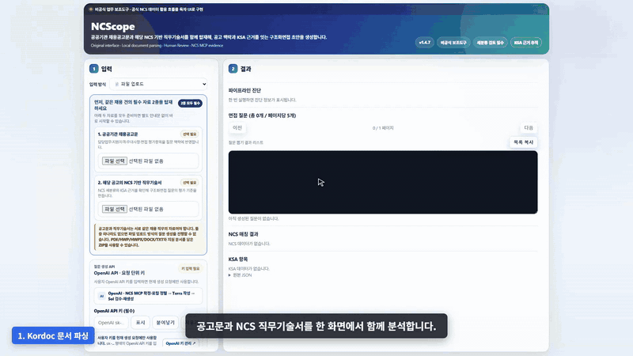
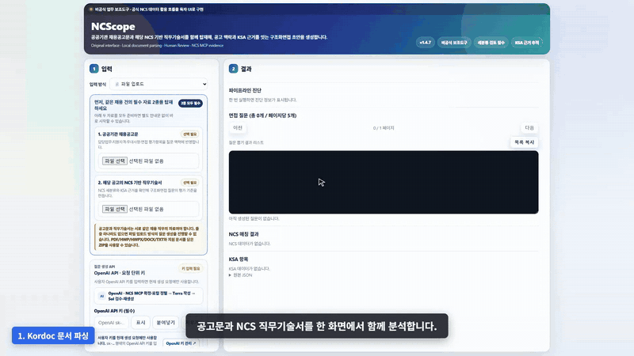

<p align="center"><strong>▶ NCScope 32초 브랜드 홍보 영상</strong></p>
<p align="center">
  <a href="./docs/media/ncscope-promo.mp4">
    
  </a>
</p>
<p align="center">문제 제기 → 핵심 가치 → 실제 제품 하이라이트 → 실행 안내 · 클릭하면 원본 MP4가 열립니다.</p>

<br>

<p align="center"><strong>▶ NCScope 2분 3초 상세 설명 영상</strong></p>
<p align="center">
  <a href="./docs/media/ncscope-explainer.mp4">
    
  </a>
</p>
<p align="center">문서 파싱부터 NCS 근거 추적 결과까지 실제 조작 전체 · 클릭하면 원본 MP4가 열립니다.</p>

<p align="center"><a href="https://ncscope.vercel.app"><strong>NCScope 실행하기</strong></a></p>

# NCScope v1.4.7

NCScope는 공공기관 채용공고문과 NCS 직무기술서를 바탕으로 공식 NCS KSA 근거가 추적되는 구조화 면접 질문 초안을 만드는 프로그램입니다.

공개 서비스: **https://ncscope.vercel.app**

## 영상으로 보는 NCScope

두 영상의 목적과 편집 문법을 분리했습니다. 홍보 영상은 NCScope가 해결하는 문제와 핵심 가치를 실제 제품 하이라이트로 짧게 전달하는 브랜드 트레일러입니다. 상세 설명 영상은 공고문과 NCS 직무기술서를 [Kordoc](https://github.com/chrisryugj/kordoc) 4.9.1로 구조화하고, 사람이 `프로젝트관리` 세분류를 확정한 뒤, 면접기법별 작성 지침과 NCS KSA 기반 결과를 확인하는 실제 조작 흐름입니다.

- [32초 브랜드 홍보 영상](./docs/media/ncscope-promo.mp4): 문제 제기 → 핵심 차별점 → 실제 제품 하이라이트 → 서비스 실행 안내
- [2분 3초 상세 설명 영상](./docs/media/ncscope-explainer.mp4): 네 단계의 실제 조작과 근거 추적 화면 전체
- 결과 장면은 비식별화한 안전한 예시 응답을 재생했으며 화면에도 `예시 결과 재생 · API 키 미사용`을 명시했습니다. 영상 제작 과정에서 API 키를 입력하거나 노출하지 않았습니다.

## 현재 질문 생성 계약

- 사용자가 화면에 본인의 OpenAI API 키를 직접 입력합니다.
- 공개 생성 provider는 `openai_api` 하나뿐입니다. OpenRouter, 서버 공용키, Codex/Claude 구독 로그인으로 우회하지 않습니다.
- OpenAI 키는 해당 요청에만 사용하고 브라우저 저장소, 파일, DB에 저장하지 않습니다. 서버의 `OPENAI_API_KEY`도 대체 키로 읽지 않습니다.
- 공개 요청은 모델을 임의로 덮어쓸 수 없습니다. 승인된 역할별 구성인 Luna(NCS 후보 재정렬) → Terra(질문 작성) → Sol(독립 검수·재생성)을 사용합니다.
- OpenAI 키의 전송 대상은 공식 `https://api.openai.com/v1`로 고정합니다.
- 주질문은 최대 5개, NCS 세분류 1개, 면접형태 1개, 전체 요청 예산은 285초입니다.
- 공식 KSA 원문과 K/S/A 유형, NCS 능력단위·요소·정의, 선택 면접형태, 실제 담당업무 맥락, 잠긴 `evidence_id`만 질문 생성 근거로 사용합니다.
- 역할별 모델은 Luna(NCS 후보 재정렬), Terra(질문 초안), Sol(독립 검수·실패 슬롯 재생성)로 분리합니다. 한 요청의 사용자 OpenAI 키만 사용하며 실제 사용 모델은 응답의 `ai_model_orchestration`에 기록합니다.
- 주질문, 꼬리질문, 평가포인트는 모두 AI가 작성합니다. 서버는 STAR 고정문구, 공통 상황, 조사 결합 문장, `server_ksa_fallback`, `template_fallback`을 만들지 않습니다.
- `evidence_id`는 근거 추적용이며 KSA 의미 측정성 통과 증명이 아닙니다.

### 면접 기본원칙 + 면접 종류별 작성 지침

`2020년 NCS기반 능력중심 채용모델 면접관 기본·심화` PDF는
[Kordoc](https://github.com/chrisryugj/kordoc) 4.9.1로
로컬 구조화한 뒤 사람이 검토해 `공통 면접 기본원칙 + 선택한 면접 종류별 작성 지침` 형태의 짧은 참고자료로 저장했습니다.
원자료의 경험·상황·토론면접 취지와 NCScope가 지원하는 인바스켓·직무지식·창의적
문제해결력면접의 지침, 개방형 질문, 답변 연동 꼬리질문, 관찰 가능한 평가 근거를
질문 작성 프롬프트에만 제공합니다. 원자료가 다루는 발표면접은 참조 기록에만 남기고
공개 선택지에서는 제외했습니다. 경험면접의 STAR도
주질문과 꼬리질문 전체에서 행동증거를 탐색하는 가이드일 뿐 고정 문구나 통과
조건이 아닙니다. 면접관 가이드 원본 PDF는 Vercel 요청마다 다시 파싱하지 않으며,
이 참고자료는 세분류 매칭·KSA 근거 확정·품질 점수·질문 공개 여부에 관여하지 않습니다.

배포본에는 원문 대신 검토된 요약인
`app/resources/ncs_interviewer_guide_2020.json`만 포함합니다. 원자료를 갱신할 때는
`scripts/verify_ncs_interviewer_guide_reference.py`로 해시와 Kordoc 구조 메타데이터를
다시 확인합니다.

## 독립 AI 품질검수

초안 생성 뒤 같은 OpenAI 연결에서 별도 고추론 품질검수를 실행합니다.

1. 한국어 문법과 자연스러움
2. 상황·직무행동·KSA 의미 연결
3. KSA 측정 가능성
4. 공고·직무기술서 근거성
5. 선택 면접기법 적합성
6. 꼬리질문의 주질문 연계성
7. 평가포인트의 관찰 가능성
8. KSA 명칭의 기계적 삽입 부재

검수는 문체 취향이 아니라 심각한 의미 이탈을 찾는 가이드 우선 정책입니다. KSA 연결·측정성, 직무 근거, 면접기법 적합성, 평가 관찰성은 3점 이상, 한국어 자연스러움·꼬리질문 연계·비기계적 표현은 2점 이상이면 통과할 수 있습니다. 전체 평균으로 추가 탈락시키지 않으며, 실질 중복은 별도 차단합니다. 실패 슬롯은 같은 공식 KSA와 직무 맥락에서 완전히 새로 한 번 생성한 뒤 다시 검수합니다.

호출 순서는 최대 `초안 생성 → AI 검수 → 실패 슬롯 재생성 → 최종 AI 검수`입니다. 최종 검수 실패나 검수 JSON 오류는 502, 네트워크 실패는 503, 전체 시간 초과는 504로 끝나며 질문을 반환하지 않습니다.

성공 응답의 공개 문항은 `question_source=openai_api`이고 `ai_quality_review.status=passed`입니다. 화면은 이 조건을 만족한 문항만 목록·복사·다운로드 대상으로 사용하며 `AI 품질검수 통과` 배지를 표시합니다. 최종 사람 검토 안내도 이 초안에만 표시합니다.

## 공공기관 데이터 처리 주의

API 데이터는 OpenAI 모델 학습에 기본적으로 사용되지 않지만, 기본 abuse monitoring 로그에는 최대 30일 보존 조건이 적용될 수 있습니다. 기관 정책과 계약 요건에 따라 OpenAI의 Zero Data Retention, Modified Abuse Monitoring, DPA 적용 가능 여부를 확인하세요.

- 개인정보, 민감정보, 비공개 보안정보는 업로드 전에 제거하거나 가리십시오.
- 담당자 이름, 전화번호, 이메일, 서명, 실제 지원자 사례를 외부 AI에 보내지 마십시오.
- 기관 정책상 외부 AI 전송이 금지된 자료에는 생성 기능을 사용하지 마십시오.
- 운영 HTTPS를 강제하고 proxy, WAF, APM, tracing, crash report에서 생성 요청 body와 Authorization 헤더 수집을 끄십시오.

공식 참고:

- [OpenAI API 데이터 제어](https://developers.openai.com/api/docs/guides/your-data#default-usage-policies-by-endpoint)
- [OpenAI Enterprise Privacy](https://openai.com/enterprise-privacy/)

자세한 운영 설정은 [DEPLOYMENT.md](DEPLOYMENT.md), 보안 경계는 [SECURITY.md](SECURITY.md)를 확인하세요.

## 로컬 실행

요구 사항:

- Python 3.11+
- Node.js 20+
- 공식 KSA를 제공하는 별도 NCS_MCP

```powershell
pip install -r requirements.txt
npm ci
$env:NCS_MCP_URL="http://127.0.0.1:8778/mcp"
python -m uvicorn app.main:app --host 127.0.0.1 --port 8015
```

브라우저에서 `http://127.0.0.1:8015`를 연 뒤 OpenAI API 키를 입력합니다. 키를 `.env`에 넣어도 공개 생성의 대체 키로 사용되지 않습니다.

## 주요 흐름

1. 공고문과 NCS 직무기술서 업로드
2. 문서 파서 추출 결과 검토·확정
3. NCS 세분류 1개와 면접형태 1개 선택
4. 공식 NCS KSA 조회 및 `evidence_id` 잠금
5. OpenAI 질문 생성
6. 독립 OpenAI 품질검수
7. 필요 시 실패 슬롯 재생성 및 최종 검수
8. 통과 문항만 표시·복사·다운로드

업로드는 PDF, HWP, HWPX, DOCX, TXT, 이미지와 이 문서들을 담은 ZIP을 지원합니다.
로컬은 Node/Kordoc을 직접 실행하고, Vercel은 같은 NCScope 배포의 인증된 비공개
Node 함수에서 Kordoc 4.9.1을 자체 실행합니다. 문서를 외부 변환 API로 보내지 않으며
`KORDOC_OFFLINE=1`로 외부 OCR·모델 다운로드를 막습니다. 운영 환경에는 저장소에
기록하지 않은 `KORDOC_BRIDGE_ED25519_PRIVATE_KEY`를 설정하며, Node 함수는 저장소에
고정한 공개키로 120초 유효 요청 서명을 검증합니다. 공유 비밀은 로컬·전환용
fallback으로만 지원합니다. Kordoc 실행이 불가능해
대체 파서를 사용한 경우 응답과 화면에 실제 파서명을 표시하며, 표 좌표가 사라진
분류표는 대분류·중분류를 제거한 뒤 공식 NCS MCP exact 결과만 세분류 후보로 확정합니다.

ALIO 첨부 메타데이터 조회는 `POST /api/alio/attachments`를 사용합니다. 외부 파일을 자동으로 내려받아 모델에 전송하지 않으며, 사람이 같은 채용 건의 공고문과 직무기술서를 확인해 기존 업로드 흐름으로 넘깁니다.

## API 실패 계약

| 상태 | 코드 | 의미 |
|---|---|---|
| 400 | `openai_api_key_required` | 요청 단위 OpenAI 키 없음 |
| 401 | `openai_api_authentication_failed` | 입력 키 인증 실패 |
| 429 | `openai_api_usage_limit_reached` | OpenAI 사용량 또는 요청 한도 |
| 502 | `openai_api_quality_rejected` | 재생성 뒤에도 독립 품질검수 실패 |
| 503 | `openai_api_unreachable` | 네트워크 연결 실패 |
| 503 | `ncs_mcp_unavailable` | 공식 세분류·능력단위 조회 장애(느슨한 매핑으로 강등하지 않음) |
| 504 | `openai_api_timeout` | 요청 예산 또는 공급자 시간 초과 |

실패 응답에는 질문 원문, API 키, 공급자 예외 문자열을 포함하지 않습니다. 화면은 업로드·세분류·면접형태 선택 상태를 유지하므로 키나 입력을 확인한 뒤 즉시 재시도할 수 있습니다.

## 검증

```powershell
python -m py_compile app/main.py app/services/ai_question_quality_review.py app/services/hwp_text_fallback.py
python -m json.tool vercel.json
pytest -q tests/test_ai_question_quality_review.py tests/test_auxiliary_ai_quality_review.py tests/test_openai_byok_contract.py
python scripts/verify_ncs_interviewer_guide_reference.py "C:\path\to\면접관+기본심화.pdf" --expected-metadata-json app/resources/ncs_interviewer_guide_2020.json
```

실모델 canary는 승인된 테스트 키와 개인정보가 없는 합성 입력으로만 수행하세요. 운영 지표는 품질 재생성률, 최종 거부율, p50/p95 지연시간, fallback 반환 0건입니다.
