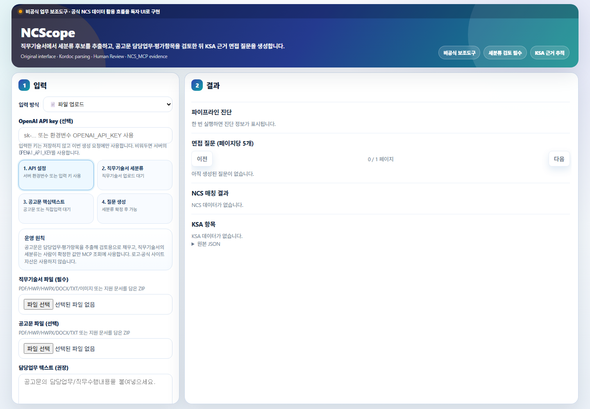
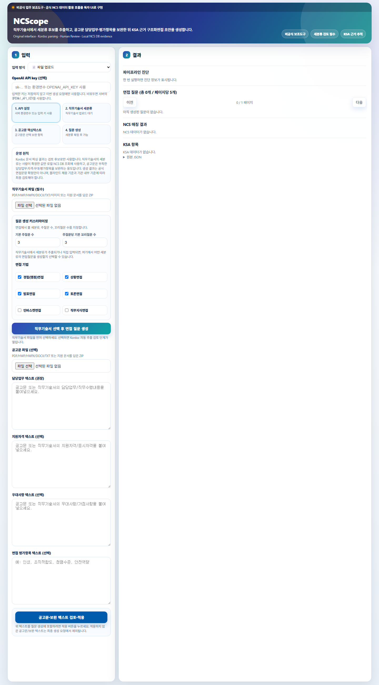

# NCScope v1.4.3

[](https://github.com/koul777/NCScope/actions/workflows/ci.yml)

공공기관 채용 공고문과 직무기술서를 올리면, NCS 세분류를 확인한 뒤 공식 KSA 근거로 구조화 면접 질문 초안을 생성하는 프로그램입니다.

NCScope는 직무기술서 파일을 Kordoc으로 파싱하고, 사람이 세분류를 최종 확인한 다음, 로컬 NCS DB 검색 서버인 NCS_MCP를 통해 공식 능력단위·수행준거·KSA를 조회합니다. 이후 해당 근거를 바탕으로 주질문, 꼬리질문, 평가포인트가 포함된 구조화 면접 질문 초안을 생성합니다.



공고문 또는 보완 텍스트는 별도 적용 버튼을 눌러야 최종 질문 생성 요청에 포함됩니다.



NCScope는 공식 NCS 사이트가 아닙니다. NCS 데이터 활용 흐름과 공공서비스형 정보 구조만 참고했으며, 공식 로고·아이콘·이미지·사이트 레이아웃을 복제하지 않는 독자 UI입니다.

운영 전제: NCScope 결과물은 공식 면접문항 확정안이 아니라 보조자료 초안입니다. 최종 문항은 기관 담당자와 평가위원이 블라인드 채용 기준, 채용공고, 직무기술서, 내부 평가기준에 맞게 검토·수정해야 합니다.

공식 서비스와의 관계, 데이터 사용, 면접 운영 책임에 대한 고지는 [`NOTICE.md`](NOTICE.md)를 참고하세요. 요청 단위 OpenAI API 키의 위험과 업로드 문서 처리 기준은 [`SECURITY.md`](SECURITY.md)에 정리했습니다. Kordoc 등 외부 구성요소 고지는 [`THIRD_PARTY_NOTICES.md`](THIRD_PARTY_NOTICES.md)에 분리했습니다.

화면은 네 단계로 구성됩니다.

1. 요청 단위 OpenAI API 키 입력
2. 직무기술서 세분류 검토
3. 공고문 핵심텍스트 보완
4. 로컬 NCS DB KSA 기반 질문 생성

## 업데이트 내역

### v1.4.3 · 2026-08-15 · 대량 질문 생성 복구와 STAR 품질 개선

- 6개 이상의 주질문은 최대 5개 단위로 나누어 최대 4개 배치를 병렬 생성하고, 원래 질문 계획·면접기법·KSA 근거 순서로 다시 병합해 대량 요청의 지연과 시간 초과를 줄였습니다.
- 품질 문제가 있는 문항만 원래 슬롯과 근거 ID를 잠근 채 재생성합니다. 중복만 발생한 모델 문항은 폐기하지 않고 사건·행동·결과 맥락을 다시 구성한 뒤 전체 세트에서 재검사합니다.
- 경험면접 주질문과 답변 연동형 꼬리질문이 STAR의 상황·역할/목표·행동/판단 근거·관찰 가능한 결과를 빠짐없이 도출하도록 보강하고, 평가포인트도 질문에서 실제로 확인할 수 있는 행동증거에 맞췄습니다.
- 공통 STAR 보완 문구 때문에 서로 다른 질문까지 중복으로 판정하던 문제, 실패 슬롯과 무관한 앞부분 문항만 재시도 문맥으로 사용하던 문제, 응답 잘림 복구 경로의 미정의 함수 오류를 수정했습니다.
- 직무기술서 표기 `비서 (글로벌경영사무 지원)`을 공식 NCS 세분류 `비서`로 제한적으로 연결해, `총무·인사`와 함께 선택했을 때 부분 매칭 오류로 전체 생성이 차단되지 않도록 했습니다. 임의의 괄호 제거 또는 유사어 자동매칭은 허용하지 않습니다.
- 실제 요청 단위 API 키로 20개 주질문과 문항당 3개 꼬리질문을 3회 연속 생성해 모두 20/20문항을 확인했습니다. 소요 시간은 18.39~23.67초였으며, 전체 회귀 테스트 `4,296 passed, 72 skipped`와 Ruff `F821` 검사를 통과했습니다.

### v1.4.2 · 2026-08-14 · OpenAI 질문 생성 안정성과 실패 진단 강화

- 질문 생성 제한 시간을 60초에서 120초로 늘리고, 경량 재시도에도 최대 90초를 허용해 여러 세분류의 구조화 질문 생성 중 발생하던 시간 초과를 줄였습니다.
- `gpt-4o-mini`가 지원하는 Structured Outputs JSON Schema를 적용해 주질문 수, 꼬리질문 수, 평가포인트와 근거 필드가 요청한 구조에 맞게 반환되도록 강화했습니다.
- 6개 주질문처럼 본문과 꼬리질문이 긴 응답이 잘리지 않도록 출력 토큰 예산을 확대하고, 토큰 한도에 따른 응답 잘림을 별도 감지합니다.
- 인증·사용량 한도·시간 초과·연결 실패·응답 잘림/형식 오류·품질검사 탈락·OpenAI 서비스 오류를 서로 다른 안전한 오류 코드와 안내문으로 표시합니다.
- 모델 오류의 원인을 보존하되 API 키, 모델 응답 원문, 내부 예외 문자열은 브라우저 응답이나 로그에 노출하지 않습니다.

### v1.4.1 · 2026-08-14 · NCS 매칭 오류와 모델 생성 오류 표시 분리

- 구조화된 API 오류를 모두 NCS 세분류 미매칭으로 표시하던 프런트엔드 분기를 수정했습니다.
- `lookup_terms`와 `suggested_ncs_units`가 있는 실제 NCS 매칭 오류만 직접입력 검토 화면으로 전환합니다.
- `openai_api_generation_failed` 등 외부 모델 생성 오류는 서버가 반환한 원인 메시지와 실패 상태를 그대로 표시합니다.
- 로컬 NCS_MCP 실검색에서 프로젝트관리 11건, 산학협력관리 13건, 경영기획 8건, 경영평가 8건, 총무 10건, 인사 14건, 비서 11건, 예산 7건의 정확 세분류 조회를 확인했습니다.

### v1.4 · 2026-08-14 · 질문 근거 무결성·현장성·운영 보안 강화

v1.4는 질문 생성 전후의 품질 경계를 세분화하고, 공개 서비스의 생성 경로와 요청 단위 자격증명 계약을 더 엄격하게 고정한 릴리스입니다.

- 공개 UI와 API는 `openai_api`만 허용합니다. Codex·Claude 개인 구독 CLI, provider 선택·fallback, 서버 환경변수 키 대체 경로는 공개 요청에서 차단합니다.
- OpenAI API 키는 현재 탭 메모리에만 유지하고 생성 요청마다 전달합니다. UI에 키 지우기와 HTTPS 전송 경고를 추가하고, query string·로그·DB·응답에 키가 남지 않도록 경계를 강화했습니다.
- 공식 KSA에서 서버가 배정한 `evidence_id`와 모델이 반환한 원시 근거 ID를 분리 보존합니다. 누락·불일치·다른 문항 근거 재사용은 자동 정규화하지 않고 최종 품질 경계에서 거부합니다.
- 질문이 실제 업무 사건·판단·행동·산출물을 요구하는지, 제시되지 않은 수치·조항을 억지로 회상시키지 않는지, 질문과 평가포인트가 같은 행동증거를 측정하는지를 각각 독립 게이트로 검사합니다.
- 경험·상황·발표·토론·인바스켓·직무지식·창의적 문제해결력면접의 문장 현실성과 K/S/A 의미 정렬을 확대 코퍼스 및 의미 오라클 회귀 테스트로 보강했습니다.
- 기관용 OpenAI 생성은 최초 요청, 경량 복구, 품질 재생성의 의미 요청 예산을 명시하고 실제 사용 횟수를 결과에 기록합니다. 품질 재시도에도 근거 배정과 전송 횟수 제한을 동일하게 적용합니다.
- 요청 크기·요청률·생성 동시성 제한, 레거시 NCS 프록시 관리자 보호, 승인된 OpenAI gateway 단일화, proxy·APM body 기록 금지 지침을 추가했습니다.
- Kordoc 표·레이아웃 파싱과 직무기술서 세분류 추출 회귀 범위를 넓히고, 정의되지 않은 Python 이름을 차단하는 Ruff `F821` 검사를 CI 품질 게이트에 포함했습니다.
- `인사, 프로젝트관리`처럼 여러 세분류를 쉼표·줄바꿈·슬래시로 함께 입력해도 각각의 공식 NCS 세분류로 분리 조회하도록 직접입력·업로드 경계를 보강했습니다.
- 검증 결과: 전체 테스트 `4,236 passed, 72 skipped`, Ruff `F821` 통과, 로컬 NCS_MCP 실제 결합 검색에서 인사 14개와 프로젝트관리 11개 등 총 25개 능력단위 조회를 확인했습니다.

### v1.3 · 2026-08-13 · 현장형 NCS 면접과제 및 검증 체계 고도화

[`PR #3`](https://github.com/koul777/NCScope/pull/3)에서 공식 KSA 문구를 지원자 질문에 기계적으로 붙이던 문제를 해결하고, 실제 직무사건·판단자료·권한 경계를 갖춘 구조화 면접과제로 전환했습니다.

- 공식 NCS KSA 원문은 내부 추적 근거와 `evidence_id`로 보존하고, 지원자 화면에는 자연어로 변환한 공개 과제 초점만 표시하도록 분리했습니다.
- 경험·상황·발표·토론·인바스켓·직무지식·창의적 문제해결력면접 7개 방식별로 질문 형식, 제공자료, 제출요건, 역할·권한 및 품질 검증 기준을 강화했습니다.
- 토론면접은 양쪽 입장이 모두 방어 가능하도록 사건·수치·절차 공백을 제시하고, 합의가 어려울 때는 미합의 쟁점과 결정권자 이송 기준까지 답하도록 개선했습니다.
- 운영시간 안내와 실질 과제 조건을 분리하고, 지원자에게 동일한 자료·기본 과제·허용 후속질문을 적용하는 표준화 조건을 추가했습니다.
- 평가표를 최대 5개 평가차원과 하나의 5단계 행동기반 평정척도로 정리해 질문·꼬리질문·평가기준이 같은 KSA를 측정하도록 연결했습니다.
- 유효한 모델 주질문은 보존하면서 문제가 있는 필드만 보정하고, 보정 후 전체 문항을 다시 검사하도록 품질 오케스트레이션을 강화했습니다.
- 대규모 코퍼스 감사, 면접방식×KSA 매트릭스, 반복 생성, 검토 수명주기, 동시성 및 실제 HTTP 흐름 검증 도구를 추가했습니다.
- 검증 결과: 깨끗한 커밋 사본 `723 passed`, 확대 매트릭스 `1,512/1,512`, 공식 KSA `574,279`행 엄격 이슈 0건, ALIO 생성 가능 문항 `28/28` 통과.
- 공개 UI와 API의 생성 경로를 `openai_api`로 고정하고, 사용자가 입력한 키를 저장하지 않은 채 생성 요청마다 전달하는 request-scoped BYOK 경계로 전환했습니다. 서버 환경변수 키는 fallback으로 사용하지 않습니다.
- 앱 화면 버전은 `v1.3`, API 및 패키지 메타데이터 버전은 `1.3.0`으로 올렸습니다.

### v1.2 · 2026-08-11 · 질문 품질 오케스트레이션 및 API 키 경계 강화

[`aee991a`](https://github.com/koul777/NCScope/commit/aee991a)에서 질문 생성 결과를 생성 직후 다시 점검하고, 문제가 있는 문항만 보정하는 런타임 품질 흐름을 추가했습니다.

- K/S/A 유형별 측정 계약과 7개 면접기법별 과제 형식 게이트를 추가했습니다. 단순 KSA 명칭 반복, 키워드 나열, 직무 맥락이 없는 질문은 통과시키지 않습니다.
- 최근 질문 최대 500개를 요청 컨텍스트별로 관리하고, 생성 offset·시나리오 변형·유사도 검사를 사용해 같은 평가 의도의 질문 재사용을 줄였습니다.
- 모델 질문은 가능한 경우 보존하되, 실패 문항만 NCS·KSA 근거와 직무 제약을 포함한 템플릿으로 재생성합니다. 보정 시도·실패 사유·최종 미해결 사유를 `question_quality_orchestration`에 남깁니다.
- 문항별 승인·수정요청·되돌리기를 운영 DB에 기록하고, review token 해시 저장, 중복 요청 멱등성, stale 요청 HTTP 409, 선행 결정 포인터 기반 롤백, 동시성 잠금을 적용했습니다.
- 브라우저가 생성 run과 문항 hash별 검토 상태를 유지하고, 검토 저장 중 재생성을 막으며, 반려·수정요청을 같은 NCS 코드의 다음 생성 문맥에 환류합니다.
- 공식 NCS 표본 프로파일, ALIO 품질 벤치마크, 재생성·리뷰 수명주기·동시성·실제 HTTP 시뮬레이션과 회귀 테스트를 추가했습니다.
- 검증 결과: 전체 테스트 `667 passed`, 공식 NCS·ALIO를 포함한 품질 루프 4개 단계 전체 통과.
- 당시에는 브라우저 키 입력을 제거했지만, 현재 v1.4 운영 계약은 요청 단위 BYOK로 변경되었습니다. 최신 보안 지침은 아래와 [`SECURITY.md`](SECURITY.md)를 따릅니다.
- 앱과 API 메타데이터 버전을 `1.2.0`으로 올렸습니다. 현재 자격증명 정책은 아래 v1.4 운영 지침을 따릅니다.

## v1.1 업데이트 (이전 버전)

v1.1은 ALIO 실공고 직무기술서와 NCS 블라인드 채용 공식 샘플을 기준으로 세분류 추출, 면접기법별 질문 품질, 검증 리포트를 강화한 버전입니다.

- ALIO 최근 공고 기반 세분류 벤치마크를 28건으로 확장하고, 후보별 원문 위치·추출 근거·MCP 매칭 유형을 진단 CSV에 기록합니다.
- 세분류가 exact로 확정되지 않는 경우를 `unit_name_only`, `specialized_healthcare_label_unserved_by_mcp`, `known_manual_review_catalog_gap`, `catalog_gap_verified_source_label`, `parsed_no_detail`, `skipped_by_max_details_per_doc`처럼 분리해 과대 매칭을 막습니다.
- 질문 품질 리포트에 `checked_detail_count`, `coverage_blocker_type`, `coverage_blocker_details`, `resolved_parent_detail`, `review_action`, `coverage_blocker_reason` 컬럼을 추가해 어떤 세분류 때문에 strict coverage가 막혔는지 추적합니다.
- 모델 원문 질문 품질을 template fallback과 분리해 집계하고, `--min-full-model-rate`, `--min-evaluated-doc-rate`, `--fail-on-repaired-followups`, `--fail-on-model-replacements`, `--fail-on-template-insertions` 게이트를 추가했습니다.
- NCS 블라인드 채용 `채용모델 면접문항`과 `전형별 평가샘플`을 함께 프로파일링해 경험·상황·발표·토론·인바스켓·창의적 문제해결력면접 형식 신호를 검증합니다.
- 공식 샘플에서 직무지식면접 사례가 관찰되지 않은 부분은 절차·기준·산출물·예외상황 중심의 내부 품질 게이트와 회귀 테스트로 보강했습니다.
- 직접 입력 경로도 업로드 경로와 동일하게 면접기법 선택, 질문 계획, KSA 보강, 모델 산출물 보정 로직을 적용합니다.

## 왜 필요한가

공공기관 채용 실무에서는 직무기술서, 공고문, NCS 세분류, 능력단위, 수행준거, KSA를 사람이 일일이 맞춰 보며 면접 질문을 설계해야 합니다. 이 과정은 시간이 오래 걸리고, 세분류를 잘못 잡으면 질문의 근거가 흔들립니다.

NCScope의 목표는 다음 흐름을 하나로 묶는 것입니다.

```text
직무기술서 업로드
        ↓
Kordoc 문서 파싱 및 세분류 후보 추출
        ↓
사람이 NCS 세분류 확인
        ↓
공고문으로 담당업무·자격·우대사항·평가항목 보완
        ↓
로컬 NCS DB 검색 서버에서 공식 능력단위·KSA 조회
        ↓
구조화 면접 질문 초안 생성
```

## 핵심 기능

- PDF/HWP/HWPX/DOCX/TXT/이미지 직무기술서와 해당 파일을 담은 ZIP 파싱
- 소분류가 아니라 세분류 기준 NCS 후보 추출
- Human-in-the-loop 방식의 세분류 검토·확정
- 확정된 세분류 기준 로컬 NCS DB 검색 서버(NCS_MCP)에서 공식 능력단위 조회
- 공식 수행준거·KSA 기반 면접 질문 초안 생성
- 세분류별 주질문 수, 주질문당 꼬리질문 수, 면접기법 선택
- 경험(행동)면접, 상황면접, 발표면접, 토론면접, 인바스켓면접, 직무지식면접 유형별 질문 생성
- NCS 2024 전형별 평가샘플에서 관찰되는 창의적 문제해결력면접 선택 생성
- 주질문, 꼬리질문, 평가포인트, NCS 매칭 결과, 질문별 KSA 근거 제공
- 면접기법별 주질문 형식, 꼬리질문 깊이, 평가포인트, KSA 근거, 직무 맥락 품질 게이트 적용
- ALIO 실문서 기반 질문 품질 리포트와 모델 원문/템플릿 보정 분리 측정
- NCS 블라인드 채용 면접과제·평가양식 샘플 프로파일링으로 면접기법별 형식 검증
- 사용자가 요청마다 제공하는 OpenAI API 키로 질문 생성
- 로컬 NCS DB 검색 서버 연결 기반의 경량 배포 구조
- 공식 NCS 사이트 자산을 사용하지 않는 비공식 독자 인터페이스

## 사용 방법

### 가장 쉬운 로컬 실행

Windows에서 이 저장소를 받은 뒤 `START_NCSCOPE.bat`를 더블클릭하면 됩니다.

실행 파일은 다음 순서로 동작합니다.

1. `.env`가 있으면 비밀이 아닌 환경설정을 불러옵니다. `OPENAI_API_KEY`는 dotenv 로더가 읽지 않으며 서버 키 fallback도 지원하지 않습니다.
2. `NCS_MCP_URL`이 로컬 주소이고 아직 켜져 있지 않으면 `C:\workspace\NCS_MCP` 또는 `..\NCS_MCP`의 로컬 NCS DB 검색 서버를 자동으로 시작합니다.
3. NCScope 앱을 `http://127.0.0.1:8015`에서 실행합니다.
4. 브라우저를 자동으로 엽니다.

현재 PC처럼 `C:\workspace\NCS_MCP\data\processed\ncs.db`가 준비되어 있으면 별도 명령 없이 실행됩니다. 다른 위치를 쓰는 경우 `.env`에 다음 값을 지정하세요.

```text
NCS_MCP_REPO=C:\workspace\NCS_MCP
NCS_DB_PATH=C:\workspace\NCS_MCP\data\processed\ncs.db
NCS_MCP_URL=http://127.0.0.1:8778/mcp
```

### 1. 화면 열기

로컬 또는 배포된 NCScope 주소를 엽니다.

```text
http://127.0.0.1:8015
```

### 2. 요청 단위 OpenAI API 키 입력

브라우저와 공개 API의 질문 생성 경로는 `openai_api`로 고정됩니다. Codex·Claude
CLI, 개인 구독 로그인, provider 선택 및 provider fallback은 지원하지 않습니다.
사용자가 화면에 입력한 OpenAI API 키는 생성할 때마다 JSON body 또는 multipart
form의 `openai_api_key`로 NCScope 서버를 거쳐 승인된 `OPENAI_BASE_URL`에
전달됩니다. URL query에는 키를 넣을 수 없습니다.

NCScope는 키를 `localStorage`, `sessionStorage`, `IndexedDB`, Cookie, 파일,
`.env`, DB, 로그, 감사로그 또는 응답에 저장하지 않습니다. 서버 환경변수
`OPENAI_API_KEY`도 fallback으로 사용하지 않으므로 요청 키를 생략하면 HTTP 400
`openai_api_key_required`가 반환됩니다. loopback 개발 환경 외에는 반드시
HTTPS로 접속하고 reverse proxy·WAF·APM의 요청 body 기록을 꺼야 합니다.

이 방식은 키를 JavaScript에 하드코딩하거나 번들링하는 방식은 아니지만, 키가
브라우저 런타임과 NCScope 서버를 통과하는 request-scoped BYOK입니다. OpenAI의
[API 키 안전 지침](https://developers.openai.com/api/reference/overview#authentication)은
클라이언트 측 브라우저·앱에 키를 노출하지 않고 서버의 환경변수나 키 관리
서비스에서 불러오도록 권고합니다. 따라서 이 배포 방식은 공식 권고의 서버 소유
비밀키 모델과 같지 않으며, 기관은 브라우저 확장·XSS·TLS 종단 프록시·서버 메모리
노출 위험을 별도로 승인해야 합니다. 상세 통제는 [`SECURITY.md`](SECURITY.md)를
참고하세요.

`GET /api/generation-provider/status`는 키를 받거나 인증하지 않습니다.
`provider=openai_api`, `auth_mode=request_scoped_api_key`, `status=key_required`와
`authenticated=false`를 반환해 요청 단위 입력이 필요함을 알립니다.

주 질문 생성은 최초 생성과 1회 slim 형식 복구를 지원합니다. 품질 실패 시에는
전체 세트를 다시 만들지 않고 실패한 문항 슬롯만 한 번 재생성합니다. 각 요청의 전송 시도는 1회이며,
실제 사용 횟수와 상한은 응답의 `strategy.model_quality_retry`와 화면 품질 안내에
비밀정보 없이 표시됩니다.
6개 이상을 요청하면 서버가 확정된 문항 순서·면접기법·KSA 근거를 유지한 채 최대 5개 단위로 나누어
동시에 생성하고, 원래 순서로 병합한 전체 세트를 다시 검사합니다. 한 배치라도 누락되거나 실패하면
불완전한 최초 결과는 반환하지 않으며, 병합 검사에서 실패한 원래 슬롯만 품질 재생성 대상으로 삼습니다.

### 3. 직무기술서 업로드

`직무기술서 파일`에 PDF/HWP/HWPX/DOCX/TXT/PNG/JPG/WEBP 파일 또는 해당 파일을 담은 ZIP을 올립니다.

Kordoc 파싱이 끝나면 다음 항목이 검토 영역에 표시됩니다.

- 수행업무
- 지원자격
- 우대사항
- 확정할 NCS 세분류

### 4. 세분류 검토·확정

자동 추출된 세분류가 맞는지 사람이 확인합니다.

예시:

```text
경영기획
총무
정보기술기획
프로젝트관리
```

필요하면 직접 수정한 뒤 `추출 결과 검토·확정` 버튼을 누릅니다.

이 단계가 중요한 이유는 NCScope가 소분류나 키워드가 아니라, 사람이 확정한 세분류를 기준으로 로컬 NCS DB 검색 서버(NCS_MCP)를 조회하기 때문입니다.

확정한 세분류가 현재 로컬 NCS serving DB와 정확히 매칭되지 않으면 NCScope는 근거 없는 질문을 자동 생성하지 않습니다. 대신 후보 NCS 능력단위를 보여주고, 담당자가 직접 선택하는 흐름으로 전환합니다.

### 5. 질문 생성 조건 설정

세분류 확정 후 다음 조건을 지정합니다.

- 어떤 세분류의 질문을 생성할지
- 세분류별 주질문 수
- 주질문당 꼬리질문 수
- 면접기법

지원하는 면접기법:

- 경험(행동)면접: 과거 수행 행동을 중심으로 미래 성과를 예측합니다.
- 상황면접: 주어진 직무 상황에서 판단, 판단 이유, 행동 의도를 묻습니다.
- 발표면접: 특정 주제나 자료에 대해 분석, 대안, 실행계획을 발표하게 합니다.
- 토론면접: 갈등 요소가 있는 과제를 두고 상호작용, 경청, 조정, 합의 도출을 봅니다.
- 인바스켓면접: 실제 직무 조건을 반영한 문서·요청·우선순위 처리 과제를 제시합니다.
- 직무지식면접: 절차, 기준, 산출물, 예외상황 대응 지식을 확인합니다.
- 창의적 문제해결력면접: 기본 7종에 포함되며, 복합 문제를 정의하고 원인 가설, 대안, 검증 방법, 실행계획을 평가합니다.

면접기법별 질문 방식은 `['24년 능력중심 채용모델] 평가위원 가이드북`의 구조화 면접 원칙과 NCS 블라인드 채용 면접과제·평가양식 샘플에서 관찰되는 과제·평가 양식 구조를 반영했습니다.

### 6. 공고문 업로드와 핵심 텍스트 보완

공고문은 선택 항목입니다. 직무기술서에 부족한 정보를 보완할 때 사용합니다.

- 공고문 파일
- 담당업무 텍스트
- 지원자격 텍스트
- 우대사항 텍스트
- 면접 평가항목 텍스트

공고문 파일을 올리면 NCScope가 담당업무, 지원자격, 우대사항, 면접 평가항목 후보를 먼저 채웁니다. 담당자는 이 내용을 검토하고 수정한 뒤 `공고문 핵심 텍스트 검토·적용`을 누르면 됩니다.

직무기술서에만 지원자격이나 우대사항이 들어 있는 경우도 처리합니다. 직무기술서 파싱 결과와 공고문 파싱 결과 중 어느 한쪽에라도 해당 내용이 있으면 중복을 제거해 질문 생성 컨텍스트에 함께 반영합니다.

주의: 공고문 파일이나 보완 텍스트를 입력해도 `공고문·보완 텍스트 검토·적용` 버튼을 누르기 전에는 최종 질문 생성 요청에 포함되지 않습니다. 텍스트를 수정하면 적용 상태가 다시 해제되므로, 수정 후 다시 적용해야 합니다.

예시:

```text
담당업무: 경영계획 수립, 사업성과 분석, 예산 운영 지원
지원자격: 관련 분야 실무경력 3년 이상
우대사항: 공공기관 사업관리 경험
평가항목: 문제해결능력, 의사소통능력, 청렴성, 조직적합도
```

### 7. 면접 질문 생성

`NCS DB KSA 기반 면접 질문 생성`을 누릅니다.

결과 영역에서 다음을 확인할 수 있습니다.

- 파이프라인 진단
- NCS 매칭 결과
- KSA 항목
- 구조화 면접 질문
- 질문별 KSA 근거
- 원본 JSON

세분류 exact 매칭이 실패한 경우에는 직접입력 모드로 전환됩니다. 이때 표시되는 후보 NCS 능력단위는 자동 확정값이 아니며, 담당자가 공식 NCS 명칭과 직무기술서를 비교해 선택해야 합니다.

## 면접 질문 품질 관리

NCScope는 질문 생성 결과를 그대로 통과시키지 않고 면접기법별 품질 게이트로 다시 점검합니다.

- 주질문이 선택한 면접기법의 형식을 따르는지 확인합니다.
- 꼬리질문이 단순 추가 질문이 아니라 판단 근거, 행동, 우선순위, 반대 의견, 자료 해석 등 기법별 후속 탐침 역할을 하는지 확인합니다.
- 평가포인트가 다른 면접기법의 루브릭으로 오염되지 않았는지 확인합니다.
- 질문, 꼬리질문, 평가포인트, 질문 초점 중 하나 이상에 선택된 NCS/KSA 근거가 실제로 반영되는지 확인합니다.
- 직무기술서 세분류에 따라 조리, 보건, 복지, 물류, 보안, 시설, 에너지, 수질, 정보기술 등 현장 자료와 이해관계자 표현을 다르게 구성합니다.
- 공개 생성 경로는 `question_source=openai_api`인 모델 산출물만 반환합니다. 근거 ID·NCS/KSA 연결·선택 KSA의 행동 측정성·지원자 노출 안전성·정밀 수치 근거 같은 필수 게이트가 실패하면 해당 슬롯만 한 번 재생성하고 전체 세트를 다시 검사합니다. 그래도 일부 슬롯만 실패하면 필수 게이트를 통과한 문항은 `question_release_status=partial_human_review_required`로 반환하고 실패 슬롯 번호를 표시합니다. 검증 메타데이터·근거 배정·전체 개수처럼 요청 단위 무결성이 깨졌거나 통과 문항이 하나도 없을 때만 HTTP 502로 거부합니다. 자연스러운 표현이나 현장성 같은 편집 품질 항목만 남으면 추가 모델 호출 없이 `human_review_required`로 반환하며, 템플릿 문항이나 다른 provider 결과로 대체하지 않습니다.
- 업로드·직접입력 텍스트는 신뢰하지 않는 데이터로 격리하고, 그 안의 지시 무시·비밀 공개·도구 실행 같은 프롬프트 주입 명령을 따르지 않습니다. 같은 공격 흔적이 주질문·꼬리질문·평가포인트에 노출되면 출력 게이트가 전체 요청을 거부합니다.
- 질문이 스스로 주장한 KSA evidence ID는 근거로 인정하지 않습니다. NCS_MCP에서 서버가 조회한 원시 KSA 행으로 재계산한 ID, NCS 코드, KSA 참조와 task frame이 모두 일치해야 합니다.
- 내부 품질 도구는 실패 원인과 deterministic repair 후보를 별도로 측정할 수 있지만, 그 결과는 공개 API 성공 응답으로 승격하지 않습니다.
- 런타임 오케스트레이터가 생성→KSA 측정→이력 중복 검사→실패 슬롯 재생성→병합 세트 최종 재검사 순서로 실행합니다. 모델 이외 출처가 섞이거나 요청 단위 무결성 검증이 실패하면 전체 요청을 거부하고, 문항 단위 실패는 안전한 통과 문항과 분리합니다.
- 품질 운영 API는 문항별 승인·수정요청·되돌리기와 멱등 재시도, stale 결정 충돌(HTTP 409), 동시성 안전성을 지원합니다. 반려·수정요청은 다음 생성 프롬프트의 개선 문맥으로 사용됩니다.
- 평정 가이드는 공식 KSA 근거와 함께 관찰 가능한 행동·판단·산출물·결과를 기록하도록 구성되며, 5단계 행동기반 평정과 면접위원 지침을 제공합니다.

과거 검증 리포트는 deterministic template fallback 품질과 model-origin 질문 품질을 분리해 집계했습니다. 현재 공개 생성 경로는 OpenAI API 모델 결과만 허용하고 provider 또는 최종 품질 게이트 실패를 템플릿으로 대체하지 않습니다. `model_quality_passed`는 본질문과 후속질문이 모두 모델 산출물로 보존된 질문만 통과로 셉니다.

## 결과물 예시

생성 결과는 다음 구조를 가집니다.

```json
{
  "interview_questions": [
    {
      "type": "경험면접",
      "competency": "경영계획 수립",
      "ncsClCd": "0201010103_22v2",
      "question_source": "model",
      "question": "사업 목표를 수립하거나 조정한 경험 중 가장 어려웠던 사례를 말씀해 주세요.",
      "follow_ups": [
        "당시 목표 설정의 근거는 무엇이었습니까?",
        "이해관계자 의견이 충돌했을 때 어떻게 조정했습니까?",
        "결과를 어떤 지표로 평가했습니까?"
      ],
      "evaluation_points": [
        "환경분석 능력",
        "목표수립의 타당성",
        "이해관계자 조정",
        "성과관리 관점"
      ]
    }
  ]
}
```

## 시스템 구조

NCScope는 앱과 로컬 NCS DB 검색 서버(NCS_MCP)를 분리해서 배포합니다.

| 구성요소 | 역할 |
| --- | --- |
| NCScope FastAPI 앱 | 화면, 업로드, 검토, 질문 생성 흐름 제어 |
| Kordoc | PDF/HWP/HWPX/DOCX/TXT/이미지 및 ZIP 내부 지원 문서 파싱 |
| NCS_MCP | 로컬 NCS DB 검색 서버. 공식 NCS 능력단위·수행준거·KSA 조회 담당 |
| serving DB | 약 117MB 경량 read-only SQLite DB |
| OpenAI API | 생성 요청마다 사용자가 제공한 키로 질문 생성 |

```text
사용자
  ↓ HTTPS에서 키 입력(브라우저 영속 저장 안 함)
NCScope UI
  ↓ 요청마다 openai_api_key를 body/form으로 전달
FastAPI(키를 파일·DB·로그에 저장하지 않음)
  ├─ Kordoc 문서 파싱
  ├─ Human review gate
  ├─ NCS_MCP_URL → 로컬 NCS DB 검색 서버에서 공식 NCS/KSA 조회
  └─ OPENAI_BASE_URL → 요청 키로 승인된 단일 gateway에서 질문 생성
```

## 설치 방법

### 1. 저장소 받기

```powershell
git clone https://github.com/koul777/NCScope.git
cd NCScope
```

### 2. Python 패키지 설치

```powershell
pip install -r requirements.txt
```

### 3. Kordoc 설치

```powershell
npm ci
```

`npm ci`는 `scripts/kordoc_parse.mjs`에서 사용하는 Kordoc Node 패키지를 설치합니다.

NCScope에서 Kordoc은 문서 본문, 표, 메타데이터를 파싱해 검토 후보를 만드는 역할만 합니다. Kordoc 결과가 곧바로 NCS 세분류나 면접 질문으로 확정되지는 않으며, 세분류 검토·확정 단계에서 사람이 확인해야 합니다.

## 로컬 NCS DB 검색 서버(NCS_MCP) 준비

NCScope 앱은 NCS SQLite DB를 직접 열지 않습니다. 경량 serving DB를 읽는 로컬 NCS DB 검색 서버(NCS_MCP)를 별도 프로세스로 실행해야 합니다.

```powershell
$env:NCS_DB_PATH="C:\data\ncs_interview_serving_release.db"
$env:NCS_MCP_READ_ONLY="1"
python -m ncs_mcp.server --transport streamable-http --host 127.0.0.1 --port 8778
```

NCS_MCP 필수 도구:

- `ncs_search`
- `ncs_unit_detail`

준비된 serving DB 아티팩트:

- Release URL: `https://github.com/koul777/NCScope/releases/tag/ncscope-db-v0.1.0-20260723`
- Release tag: `ncscope-db-v0.1.0-20260723`
- DB asset: `ncs_interview_serving_release.db`
- Manifest asset: `ncs_interview_serving_release.json`
- DB SHA-256: `F9BB59B8853E8F69DC4698028EC347ED9BD74D26133FBCEB031B05FD90F89B23`

## NCScope 실행

로컬에서는 `.env.example`을 `.env`로 복사한 뒤 필요한 값을 채울 수 있습니다.

```powershell
Copy-Item .env.example .env
```

보안상 FastAPI 앱 import 시점에는 `.env`를 자동으로 읽지 않습니다. 로컬 실행은 `.\run_local.ps1`을 권장합니다. 이 스크립트는 현재 프로세스에 비밀이 아닌 `.env` 설정만 읽어 들이며 `OPENAI_API_KEY`는 무시합니다. OpenAI API 키는 서버에 설정하지 않고 화면에서 요청 단위로 입력합니다.

```powershell
$env:NCS_MCP_URL="http://127.0.0.1:8778/mcp"
$env:OPENAI_BASE_URL="https://api.openai.com/v1"
$env:MAX_UPLOAD_MB="30"
python -m uvicorn app.main:app --reload --host 127.0.0.1 --port 8015
```

키를 환경변수, 문서, 명령행 또는 셸 기록에 넣지 마세요. 브라우저 화면에서만
입력하며, loopback 외 배포에서는 HTTPS가 먼저 구성되어 있어야 합니다.

또는:

```powershell
.\run_local.ps1
```

## 환경변수

| 변수 | 필수 여부 | 기본값 | 설명 |
| --- | --- | --- | --- |
| `NCSCOPE_LOAD_DOTENV` | 선택 | `false` | 앱 import 시 `.env` 자동 로드 여부. 배포/테스트 기본값은 비활성화 |
| `NCS_MCP_URL` | 필수 | 없음 | 로컬 NCS DB 검색 서버(NCS_MCP) Streamable HTTP 주소 |
| `INTERVIEW_GENERATION_PROVIDER` | 선택 | `openai_api` | 공개 UI/API의 고정 provider. 다른 값은 거부 |
| `OPENAI_API_KEY` | 사용 금지 | 없음 | 서버 env fallback 없음. 실제 키는 생성 요청마다 body/form의 `openai_api_key`로 전달 |
| `OPENAI_BASE_URL` | 선택 | `https://api.openai.com/v1` | 기관 관리자가 승인한 단일 OpenAI 호환 gateway |
| `OPENAI_MODEL` | 선택 | `gpt-4o-mini` | 일반 모델 설정 |
| `OPENAI_STRATEGY_MODEL` | 선택 | `gpt-4o-mini` | 면접 질문 생성 모델 |
| `OPENAI_HTTP_CURL_FALLBACK_ENABLED` | 선택 | `false` | Python HTTP 실패 시 curl fallback 사용. 요청 키 노출 위험 때문에 opt-in |
| `DATABASE_URL` | 선택 | `sqlite:///./ncscope.db` | 앱용 소형 DB |
| `MAX_UPLOAD_MB` | 선택 | `30` | 업로드 제한 |
| `MAX_REQUEST_BODY_MB` | 선택 | `MAX_UPLOAD_MB×2+2` | multipart·JSON을 포함한 HTTP 요청 전체 제한 |
| `KORDOC_OCR` | 선택 | `true` | Kordoc OCR 경로 사용 |
| `ENABLE_ADMIN_ENDPOINTS` | 선택 | `false` | 관리자 API 활성화 |
| `ADMIN_TOKEN` | 조건부 | 없음 | 관리자 API 사용 시 필요 |
| `ENABLE_LEGACY_NCS_API` | 선택 | `false` | 레거시 NCS API 재활성화 |

면접 생성 MVP 경로는 `NCS_MCP_URL`을 필수로 요구합니다.
KSA 조회는 로컬 NCS DB 검색 서버(NCS_MCP) 연결을 기준으로 동작하므로, 운영 전 `NCS_MCP_URL`이 정상 연결되는지 확인해야 합니다.

## API 요약

### 직무기술서 파싱·검토

```http
POST /api/jd/parse-review
```

Form:

- `jd_file`: PDF/HWP/HWPX/DOCX/TXT/이미지 직무기술서 또는 지원 파일을 담은 ZIP

반환:

- 문서 markdown
- 수행업무
- 지원자격
- 우대사항
- `fields.ncs_detail_candidates`

### NCS 능력단위 검색·수동 선택 후보

```http
GET /api/ncs/units/options?q=경영기획
```

반환:

- exact 세분류 매칭 성공 시 `source: ncs-mcp`
- exact 매칭 실패 후 후보만 있는 경우 `source: ncs-mcp-suggest`
- `ncs-mcp-suggest`는 자동 확정이 아니라 사람이 선택해야 하는 후보입니다.

### 업로드 기반 면접 질문 생성

```http
POST /api/jd/strategy/upload
```

Form:

- `jd_file`: 원본 직무기술서
- `notice_file`: 선택 공고문
- `jd_review_json`: 사람이 검토·확정한 JSON
- `generation_provider`: 생략하거나 `openai_api`만 사용. 다른 provider는 거부
- `duty_text`: 선택 담당업무 보정 텍스트
- `evaluation_text`: 선택 평가항목 텍스트

필수 review gate:

```json
{
  "review_confirmed": true,
  "fields": {
    "ncs_detail_candidates": ["경영기획"]
  }
}
```

`review_confirmed`가 정확히 `true`가 아니거나 세분류가 비어 있으면 로컬 NCS DB 조회를 진행하지 않습니다.

### 직접 선택한 NCS 기준 질문 생성

```http
POST /api/questions/generate-from-text
```

JSON:

```json
{
  "openai_api_key": "<요청 시 입력한 키>",
  "notice_text": "담당업무 ...",
  "evaluation_text": "평가항목 ...",
  "selected_ncs": [
    {
      "ncsClCd": "0201010103_22v2",
      "compeUnitName": "경영계획 수립"
    }
  ]
}
```

모든 생성 endpoint는 `openai_api_key`를 JSON body 또는 multipart form으로 받아
해당 요청에만 사용합니다. 위 값은 형식 표시용 placeholder이며 실제 키를 문서,
테스트, 명령행 또는 로그에 복사하지 마세요. 요청 키가 없으면 서버 환경변수와
관계없이 HTTP 400 `openai_api_key_required`를 반환합니다. OpenAI 호출 또는 근거·안전
필수 품질 게이트가 실패하면 비밀값과 upstream 원문을 제거한 HTTP 502를 반환합니다.
근거·안전 필수 게이트는 모델 재생성을 한 번 시도해도 해결되지 않으면 거부하고,
편집 품질 항목만 남은 모델 초안은 추가 호출 없이
`question_release_status=human_review_required`로 표시해 반환하며 템플릿 질문으로 대체하지 않습니다.

## 검증 방법

```powershell
python -m py_compile app\main.py app\settings.py app\repository.py app\models.py app\services\jd_strategy.py app\services\ncs_mcp_client.py app\services\question_generation.py app\services\kordoc_parser.py app\services\external_api.py scripts\benchmark_alio_jd.py scripts\evaluate_alio_question_quality.py scripts\benchmark_ncs_official_interview_samples.py
python -m pytest -q
```

현재 검증 결과(2026-08-11 KST 세션 기준):

- 격리된 pytest 임시 디렉터리 기준 전체 테스트 → `667 passed`
- `python -m compileall -q app scripts tests` → passed
- `app/static/index.html` inline script parse → passed
- `ruff check --select F821 app scripts tests` → passed
- `git diff --check` → passed
- `python scripts\run_question_quality_loop.py --cycles 1` → 4개 품질 단계 전체 passed
- Kordoc 최신 npm 버전 `4.2.7` 확인

## ALIO·NCS 공식 샘플 벤치마크

실제 공공기관 채용공고의 직무기술서를 내려받아 세분류 추출과 질문 품질을 확인할 수 있습니다.

```powershell
$env:NCS_MCP_URL="http://127.0.0.1:8778/mcp"
python scripts\benchmark_alio_jd.py --limit 28 --include-ksa
python scripts\evaluate_alio_question_quality.py --benchmark-mode template --limit 28 --questions-per-doc 6 --follow-up-count 3
python scripts\benchmark_ncs_official_interview_samples.py --collection all --limit 5
```

`evaluate_alio_question_quality.py`는 기본적으로 `.env`에서 `NCS_MCP_URL` 등 비밀이 아닌 설정만 읽고, 해당 값이 없으면 리포트를 만들기 전에 실패합니다. 환경 파일 검사를 끄려면 `--no-load-dotenv`를 지정할 수 있습니다. 실제 API 모델 검증은 키를 리포트·fixture·명령행에 남기지 않는 별도 통합 환경에서 요청 단위로 수행하고, 실행 후 제한된 project key를 폐기·교체하세요.

확장 직무기술서 세분류 벤치마크(28건):

- `reports/alio_jd_benchmark_20260724_034457.md`
- `reports/alio_jd_benchmark_20260724_034457.csv`
- `reports/alio_jd_detail_diagnostics_20260724_034457.csv`

관찰 결과:

- 최근 ALIO 공고 28건 시도, 25건 문서 파싱
- 세분류 후보가 있는 문서 19건, 총 세분류 후보 65개
- MCP 연결 오류 0건
- MCP URL 미설정으로 세분류 진단을 생략한 문서 0건
- unit-name 회수 1건/2개 라벨, partial MCP 매칭 3건
- `건축감리`는 공식 세분류 `건축공사감리`로 안전 alias 회수
- `유지관리`는 넓힌 exact 검색 window에서 공식 세분류 `건설시공후관리 > 유지관리`로 회수
- unmatched 세분류 후보 14개
- detail diagnostics `review_action`: `auto_exact_detail=49`, `manual_review_healthcare_specialized_label=14`, `manual_review_unit_name=2`
- detail diagnostics `match_diagnostic`: `exact_detail=49`, `specialized_healthcare_label_unserved_by_mcp=14`, `unit_name_only=2`
- detail diagnostics는 세분류 후보별 `extraction_source`, `extraction_page`, `extraction_line`, `extraction_snippet`, `match_diagnostic`, `resolved_parent_detail`을 함께 기록해 manual review 대상 라벨의 원문 근거와 매칭 유형을 추적할 수 있습니다.
- `카지노 고객 지원`, `카지노 영업 지원`처럼 세분류가 아니라 능력단위명만 일치한 경우는 `unit_name_only`로 분리하고, 부모 세분류 `카지노운영관리`는 `resolved_parent_detail`에만 기록합니다.
- `간호업무 보조`, `간호행정 보조`, `간호수행`, `간호행정관리`, `영상의학`, `임상병리` 같은 보건의료 특화 라벨은 직무기술서 원문에서 추출된 NCS-like 라벨로 유지하되, 현재 serving DB exact 근거가 없으면 자동 alias하지 않고 `manual_review_healthcare_specialized_label`로 분리합니다.
- 보건의료 특화 라벨, canonical detail gap, unit-name-only 회수, semantic suggestion 분류는 `scripts/detail_gap_classifier.py`의 공통 classifier를 사용해 JD 벤치마크와 질문품질 리포트가 같은 기준으로 manual review 사유를 기록합니다.
- `연구(미개발)` 같은 inline 미개발 표기는 자동 매칭 후보가 아니라 `no_ncs_mapping_declared`로 분류
- `parsed_no_detail` 카테고리: `declared_no_ncs_mapping=2`, `no_explicit_ncs_detail=4`
- `parsed_no_detail` 사유: `job_document_without_explicit_ncs_detail=2`, `multi_role_healthcare_document_without_explicit_ncs_detail=1`, `no_ncs_mapping_declared=2`, `translation_role_without_explicit_ncs_detail=1`
- `parsed_no_detail` 상태 진단은 `no_detail_category`, `saw_ncs_table`, `saw_detail_header`, `blank_or_dash_detail_cell`, `declared_no_mapping`, `filtered_candidate_reason`을 함께 기록합니다.

8건 JD smoke 보조 벤치마크:

- `reports/alio_jd_benchmark_20260724_025316.md`
- `reports/alio_jd_benchmark_20260724_025316.csv`
- `reports/alio_jd_detail_diagnostics_20260724_025316.csv`
- 최근 ALIO 공고 8건 시도, 6건 문서 파싱
- 총 세분류 후보 17개, `exact_detail=15`, `unit_name_only=2`, unmatched 0개
- `parsed_no_detail` 카테고리: `declared_no_ncs_mapping=2`, `no_explicit_ncs_detail=2`

템플릿 질문 품질 리포트:

- `reports/alio_question_quality_20260724_032847.md`
- `reports/alio_question_quality_20260724_032847.csv`
- `reports/alio_question_quality_items_20260724_032847.csv`

관찰 결과:

- 최근 ALIO 공고 28건 시도, 18건 질문 품질 평가
- 템플릿 보정 질문 108개 중 108개 ready
- 기본 6종 경험면접, 상황면접, 발표면접, 토론면접, 인바스켓면접, 직무지식면접 모두 18/18 ready
- 발표면접 주질문은 준비시간·발표·질의응답, 토론면접 주질문은 토론시간·입장발표, 창의적 문제해결력면접 주질문은 미래예측·실현가능성·의사결정 신호까지 공식 샘플 형식 게이트로 확인
- 세분류 strict source-explicit coverage와 질문 ready를 동시에 만족한 문서 11건
- unit-name 회수 1건, 문맥 기반 세분류 회수 3건
- unmatched 세분류 라벨 14개
- 모델 후보 질문 수신 0건. 현재 수치는 LLM 원문 품질이 아니라 deterministic fallback 품질 기준입니다.
- serving DB exact 매칭이 없는 `문화〮관광정책`, `간호수행`, `간호행정관리`, `임상병리` 등은 자동 확정하지 않고 수동 검토 대상으로 남깁니다.

최근 모델 원문 질문 보존 샘플:

- `reports/alio_question_quality_20260724_024340.md`
- `reports/alio_question_quality_20260724_024340.csv`
- `reports/alio_question_quality_items_20260724_024340.csv`
- ALIO 최근 공고 8건 중 4건, 총 24문항 평가
- 최종 질문 24/24 ready
- 모델 후보 24문항 수신, 완전 모델 보존 5문항, 본질문 보존+후속질문 초점어 보정 19문항, 본질문 보존+후속질문 템플릿 보정 0문항
- `template_fallback` 교체 0문항
- 이 과거 샘플은 완전 모델 보존 ready만 모델 품질로 세던 보수적 기준으로 작성되었습니다.
- 기본 6기법 모두 4/4 ready이며, 최종 질문 품질 이슈는 0건입니다.

모델 원문 품질 집계 대표 샘플:

- `reports/alio_question_quality_20260724_055305.md`
- `reports/alio_question_quality_20260724_055305.csv`
- `reports/alio_question_quality_items_20260724_055305.csv`
- ALIO 최근 공고 8건 시도, 4건 질문 품질 평가, 총 28문항 평가
- 최종 질문 28/28 ready, model-origin ready 28/28
- 완전 모델 보존 28문항, 본질문 보존+후속질문 초점어 보정 0문항, 본질문 보존+후속질문 템플릿 보정 0문항
- 최신 리포트는 `--min-model-ready-rate 1.0`, `--min-full-model-rate 1.0`, `--fail-on-repaired-followups`, `--fail-on-model-replacements`, `--fail-on-template-insertions` 조건을 함께 통과했습니다.
- 7기법 경험면접, 상황면접, 발표면접, 토론면접, 인바스켓면접, 직무지식면접, 창의적 문제해결력면접 모두 4/4 ready입니다.
- model-origin 품질 통과 문서 4건, strict source-explicit coverage까지 함께 통과한 문서 2건입니다.
- strict coverage blocker는 `known_manual_review_catalog_gap=2`, `parsed_no_detail=2`, `specialized_healthcare_label_unserved_by_mcp=2`, `unit_name_only=2`로 남기며, 자동 승격하지 않습니다.
- `template_fallback` 교체 0문항
- 새 `--min-evaluated-doc-rate` 게이트는 세분류 미매칭/parsed-no-detail 때문에 질문 평가까지 간 문서 수가 너무 적은 실행을 실패 처리합니다. 예: `reports/alio_question_quality_20260724_052328.md`는 model-origin 6/6 ready였지만 1/4 문서만 평가되어 `evaluated_doc_rate 0.25 below minimum 0.75`로 실패 처리했습니다.
- 새 coverage blocker 상세 컬럼(`checked_detail_count`, `coverage_blocker_type`, `coverage_blocker_details`, `resolved_parent_detail`, `review_action`, `coverage_blocker_reason`) 적용 후 스모크: `reports/alio_question_quality_20260724_055305.md`

NCS 공식 블라인드 채용 면접과제·평가양식 샘플 프로파일링 결과:

- `reports/ncs_official_interview_samples_20260724_052031.md`
- 창의적 문제해결력 포함 7기법 모델 샘플: `reports/alio_question_quality_20260724_045325.md`
- `채용모델 면접문항` 12건과 `전형별 평가샘플` 12건을 함께 프로파일링
- 과제·평가양식 pair 24/24 확인
- 관찰된 면접기법: 경험면접, 발표면접, 상황면접, 토론면접, 창의적 문제해결력면접, 인바스켓면접
- 제목 기반 NCS 코드 힌트 23/24건, 세분류/직무 라벨 힌트 24/24건 추출
- 추가 탐색 리포트 `reports/ncs_official_interview_samples_20260724_051119.md`(전형별 평가샘플 40건)와 `reports/ncs_official_interview_samples_20260724_051451.md`(채용모델 면접문항 80건)에서도 직무지식면접 공식 샘플은 관측되지 않았습니다. 직무지식면접은 현재 내부 품질 게이트와 회귀 테스트로 보강합니다.
- 멤버 기법 row 기준 후보자 지시 14건, 면접위원/평가위원 지시 43건, 시간제한 신호 16건, 채점기준 27건, 평정 스케일 50건 확인
- 구조화 신호로 시간값 13건, 평정 라벨 58건, 평가요소 45건, 과제 prompt style 7종을 추출했습니다.
- 단일 HWP 안에 여러 면접기법이 함께 들어간 2024 전형별 평가샘플은 기법별 문서 구간을 우선 사용하며, section-specific context 23개 row를 확인했습니다. 목차 marker와 `Business Case` 등 미지원 면접 heading을 section boundary로 구분해 최대 section context 길이를 101,062자에서 41,352자로 줄였습니다.
- 7기법 샘플은 최종 질문 28/28 ready, 창의적 문제해결력면접 4/4 ready입니다. 완전 모델 보존은 28문항, 본질문 보존+후속질문 초점어 보정은 0문항, 후속질문 템플릿 보정과 `template_fallback` 교체도 0문항입니다.
- 2024 전형별 평가샘플에서 직무기술서, 채용공고, 면접질문지, 평가표 포함 여부를 함께 확인

## Docker 배포

빌드:

```powershell
docker build -t ncscope-app .
```

실행:

```powershell
docker run --rm -p 8015:8000 `
  -e NCS_MCP_URL="http://host.docker.internal:8778/mcp" `
  -e MAX_UPLOAD_MB="30" `
  ncscope-app
```

Docker 이미지에는 앱만 포함합니다. NCS 데이터 조회는 별도 로컬 NCS DB 검색 서버(NCS_MCP)를 통해 수행합니다. 컨테이너나 secret manager에 `OPENAI_API_KEY`를 주입하지 마세요. 사용자가 브라우저에 입력한 키는 HTTPS 생성 요청마다 NCScope 서버를 통과하므로, 외부 공개 시 TLS를 강제하고 proxy·WAF·APM의 body 기록을 꺼야 합니다. `OPENAI_BASE_URL`에는 승인된 gateway 한 곳만 설정합니다.

자세한 배포 절차는 `DEPLOYMENT.md`를 참고하세요.

## 데이터와 배포 구조

NCScope는 화면, 문서 파싱, 사람 검토, 면접 질문 생성을 담당합니다. NCS 능력단위·수행준거·KSA 데이터는 로컬 NCS DB 검색 서버(NCS_MCP)에서 조회합니다.

운영자는 경량 serving DB를 읽는 NCS_MCP를 먼저 실행한 뒤 `NCS_MCP_URL`을 NCScope에 연결하면 됩니다. 자세한 서버 구성과 배포 절차는 `DEPLOYMENT.md`에 정리되어 있습니다.

## 현재 지원 범위

- ZIP은 암호가 없고 내부에 PDF/HWP/HWPX/DOCX/TXT/이미지 파일이 들어 있는 경우에만 파싱합니다. 압축 내부 파일이 너무 크거나 지원 확장자가 없으면 검토 단계에서 오류로 돌려줍니다.
- 기관 자체 용어가 NCS 세분류처럼 쓰이는 경우에는 자동 후보가 부족할 수 있습니다. 이 경우 검토 단계에서 담당자가 세분류를 직접 선택하거나 수정해야 합니다.
- 생성된 면접 질문은 담당자 검토를 거쳐 최종 확정하는 초안입니다.

## 사용 전 확인할 점

실제 운영 전에 기관 내부 기준에 따라 다음을 확인해야 합니다.

- 직무기술서와 공고문에 개인정보가 포함되는지
- OpenAI API 사용 시 데이터 처리 정책이 기관 기준에 맞는지
- NCS 원천 데이터와 serving DB 배포 방식이 라이선스·보안 기준에 맞는지
- 면접 질문을 최종 확정하기 전 담당자가 NCS 근거와 질문 적합성을 검토했는지

## AX 증거 기반 품질 운영

생성 결과에는 공식 NCS 평가양식 구조를 반영한 상·중·하 행동기반 평정과 면접위원 지침이 포함됩니다. 화면에서 각 문항을 승인하거나 수정 요청하면 구조화된 이슈가 운영 DB에 기록되고, 반려 문항은 같은 NCS 코드의 다음 생성에서 반복 금지·개선 문맥으로 환류됩니다.

- 품질 지표: `GET /api/ops/quality-metrics`
- AX 13개 관문 자체점검: `GET /api/ops/ax-readiness`
- 반복 품질 사이클: `python scripts\run_question_quality_loop.py --cycles 1`
- 상세 기준: [`docs/AX_EVIDENCE_GATE_MAP.md`](docs/AX_EVIDENCE_GATE_MAP.md)

AX 단계는 합산 점수가 아닙니다. 코드나 설계만 있는 관문은 `설계·시범`으로 표시하고, 실제 리뷰·이관·회귀·장애훈련·SLA 기록이 없는 관문은 운영 증거로 올리지 않습니다.

## Kordoc 사용 고지

NCScope의 직무기술서·공고문 파싱 기능은 [Kordoc](https://github.com/chrisryugj/kordoc)을 사용합니다.

- 사용 위치: `scripts/kordoc_parse.mjs`
- 사용 목적: PDF/HWP/HWPX/DOCX/TXT/이미지 문서에서 본문·표·메타데이터를 추출해 검토 후보 생성
- 검토 원칙: Kordoc 추출 결과는 자동 확정값이 아니며, 세분류와 공고문 핵심 텍스트는 사람이 검토·확정해야 함
- 라이선스: Kordoc은 별도 MIT 라이선스 프로젝트이며, 자세한 내용은 [`THIRD_PARTY_NOTICES.md`](THIRD_PARTY_NOTICES.md)를 확인
